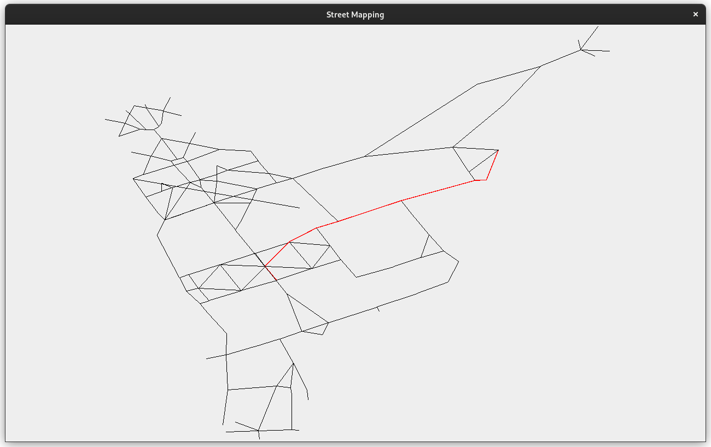
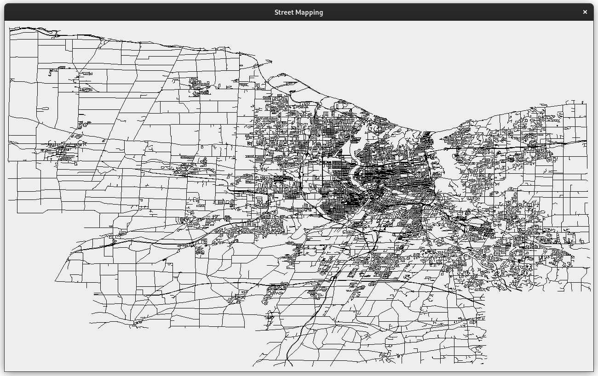
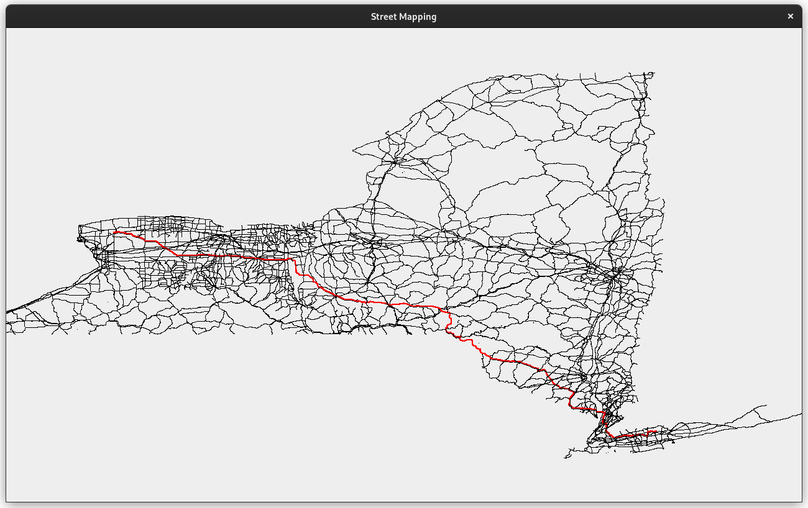

# Trailblazer

An interactive desktop map that can help you find the shortest path between two
intersections.

## Build

This project uses Maven.

```
mvn package
```

## Run

```
mvn exec:java -Dexec.args="FILE [--directions START END] [--show]"
```
where:
- `FILE` is the file that contains the map data;
- `START` is the ID of the start intersection;
- `END` is the ID of the end intersection.

## Controls

- Mouse drag to drag the map
- Mouse scroll to zoom in and out
- Ctrl + mouse drag to rotate the map

## Available data

Data is fetched from the [`data`](data) folder. Currently, the following maps
are available:

- `ur.txt`: The University of Rochester's pedestrian walkside data;
- `monroe.txt`: The Monroe county in the state of New York;
- `nys.txt`: The entire state of New York (including Long Island!)

Data is from [OpenStreetMap](https://www.openstreetmap.org).

## Examples

```
mvn exec:java -Dexec.args="data/ur.txt --directions SUEB HOYT --show"
```

…shows UR freshmen how to get from their dorm to Hoyt auditorium (where the
intro CS class usually takes place)!



The command line output shows the intersections one has to take:

```
Going from SUEB to HOYT
SUEB
UHS
i76
i60
i55
i42
MOREY
i45
HOYT
Total miles travelled: 0.23207491657297358
```

Here are some more examples.

```
mvn exec:java -Dexec.args="data/monroe.txt --show"
```

…shows the Monroe county.



```
java App data/nys.txt --directions i102030 i80549 --show
mvn exec:java -Dexec.args="data/nys.txt --directions i102030 i80549 --show"
```

…shows how to get from the very West of the NY state all the way to Long Island
in 3 seconds! FWIW, this map has 389818 intersections.



## To-do

- [ ] Show raster tiles instead of drawing the roads (WIP!)
- [ ] Create panels for GUI controls
  - [ ] Allow users to enter locations based on longtitude/latitude or human
        address
  - [ ] Allow users to switch between maps
- [ ] Fetch XML from OpenStreetMap and parse for data
